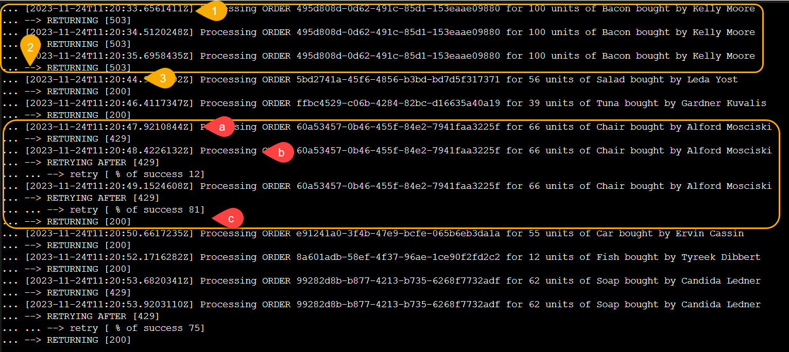

# aca-resiliency
Simple lab to discover how resiliency policies works in Azure Container Apps

```
cd src

$vGen="4.0.0"
$vPro="0.0.4"

docker build . --tag aca-processor:$vPro --file .\OrderProcessor\Dockerfile --no-cache
docker build . --tag aca-generator:$vGen --file .\OrderGenerator\Dockerfile --no-cache

docker run -p 8092:80 --detach aca-processor:$vPro

docker run -p 8091:80 --detach aca-generator:$vGen -e "ACA_APP_Target_URL=http://localhost:8092" -e "ASPNETCORE_ENVIRONMENT=Development" -e "ASPNETCORE_URLS=http://+:80"

```

Publish on docker hub

```
docker login -u massimocrippa -p surething

docker tag aca-generator:$vGen massimocrippa/aca-generator:$vGen
docker push massimocrippa/aca-generator:$vGen

docker tag aca-processor:$vPro massimocrippa/aca-processor:$vPro
docker push massimocrippa/aca-processor:$vPro

```

## Deploy Infra, App and resiliency policy

```
cd infra

sh deploy-lab-on-consumption-v2.sh

```

## Test the resiliency policy

Use the aca-generator to trigger N requests to the aca-processor API

Circuit breaker
- 1 returns 503
- 2 after three 503 a circuit breaker is triggered
- 3 the circuit is reopened after 10 seconds

Retry
- a 429 is returned
- a the call is retried but fails again
- 200 ok is returned with the third try

